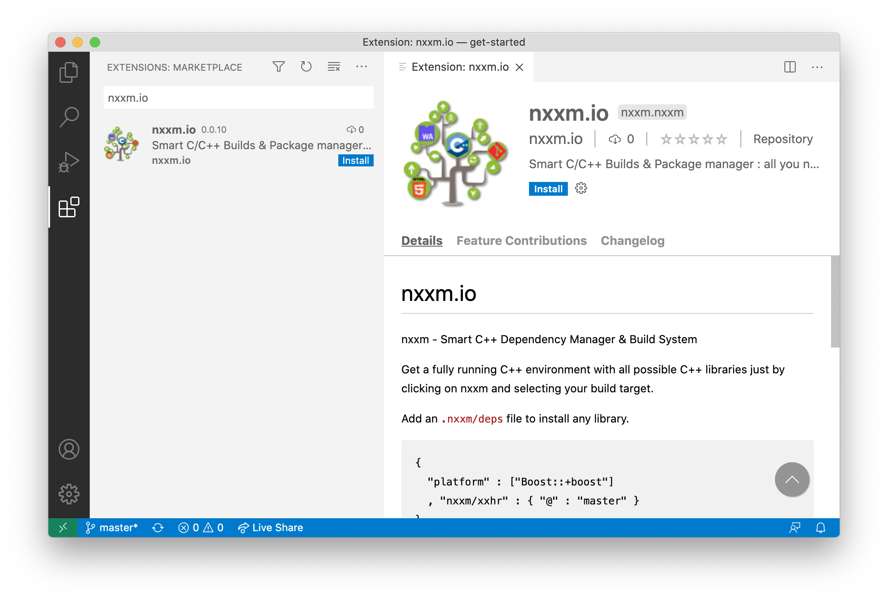

# nxxm - Smart C++ Dependency Manager & Build System
*WebAssembly Enabled and supports any of your platforms or environment !*
Please head up to [our website](https://nxxm.github.io/)

## Flavours
Available as command line tool or vscode plugin !

## Support
*  : Asks us anything and our community.
* [Ask us on Github Issues](https://github.com/nxxm/nxxm/issues/new)
* [Contact via our Website](https://nxxm.github.io)

### Add to vscode

[Click Here to add nxxm.io to vscode]()

### Install on Linux / macOS 
`/bin/bash -c "$(curl -fsSL https://raw.githubusercontent.com/nxxm/nxxm/master/install/install_for_macos_linux.sh)"`

Paste that in a Linux shell prompt or in a macOS Terminal.

### Install on Windows 10
`. { iwr -useb https://raw.githubusercontent.com/nxxm/nxxm/master/install/install_for_windows.ps1 } | iex`

Paste that in a Powershell (run as Administartor).

# License
Binaries delivered here are under copyright by nxxm, see [LICENSE](./LICENSE)

Open-source projects like Boost, CMake, Emscripten, Hunter and thousands of other libraries are the giants' shoulders nxxm is standing on. The nxxm project is happy and truly thankful to live in a time where we can participate in such lively and creative communities with so many cool ideas and so much passion. Without those, developing nxxm would not have been possible.

Open-source lets us take part in building the future. Let’s do it together.

Therefore here the opensource components, release as opensource code developed by nxxm : 
  * [nxxm/gh](https://github.com/nxxm/gh)
  * [nxxm/htmlpp](https://github.com/nxxm/htmlpp)
  * [nxxm/cli\_widgets](https://github.com/nxxm/cli_widgets)
  * [xxhr : HTTP at your fingertips](https://github.com/daminetreg/xxhr)
